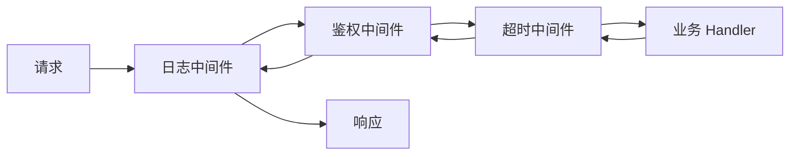
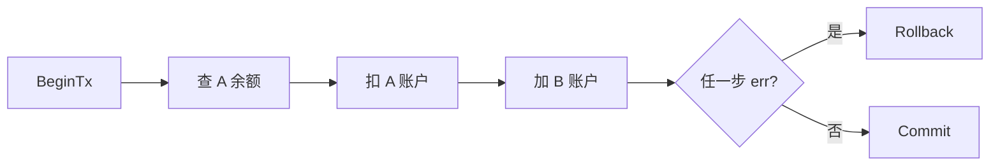
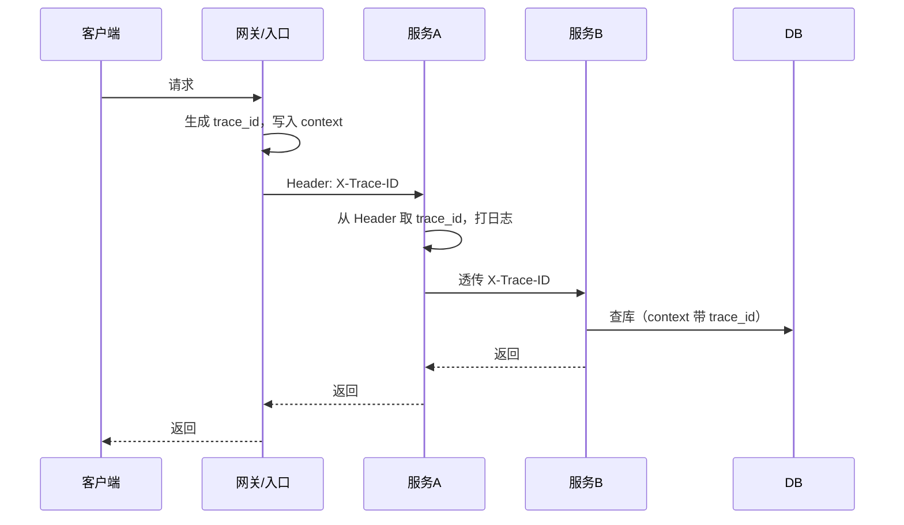
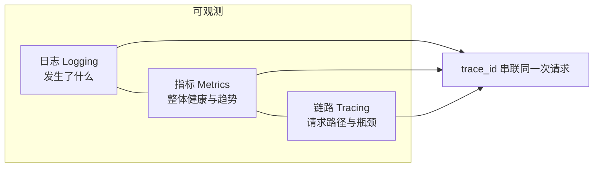
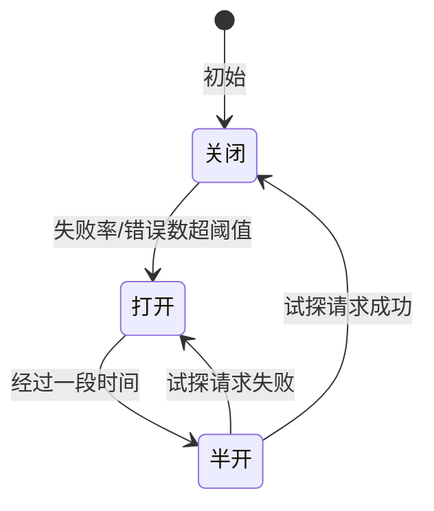
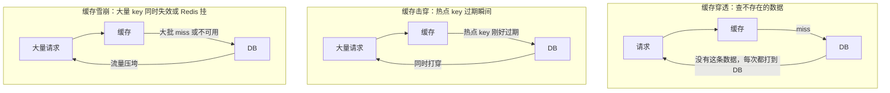
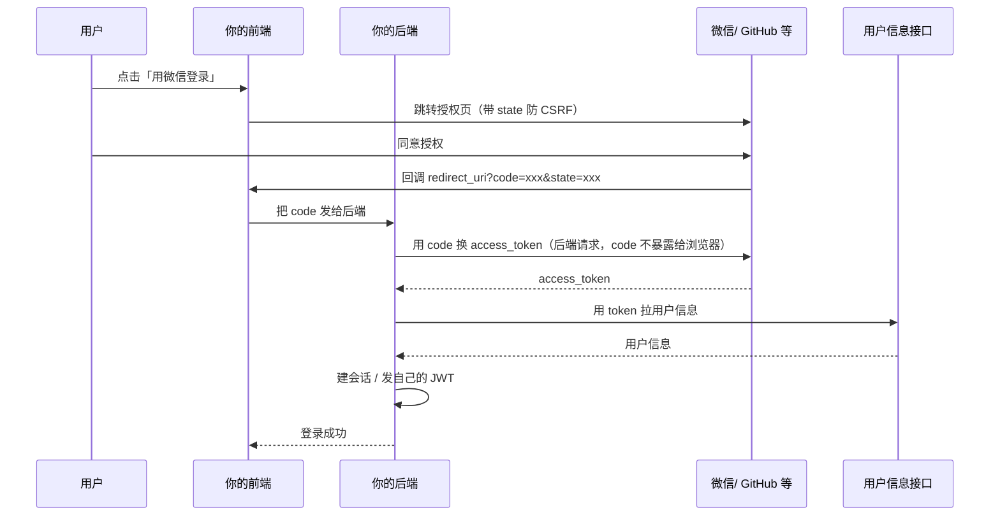
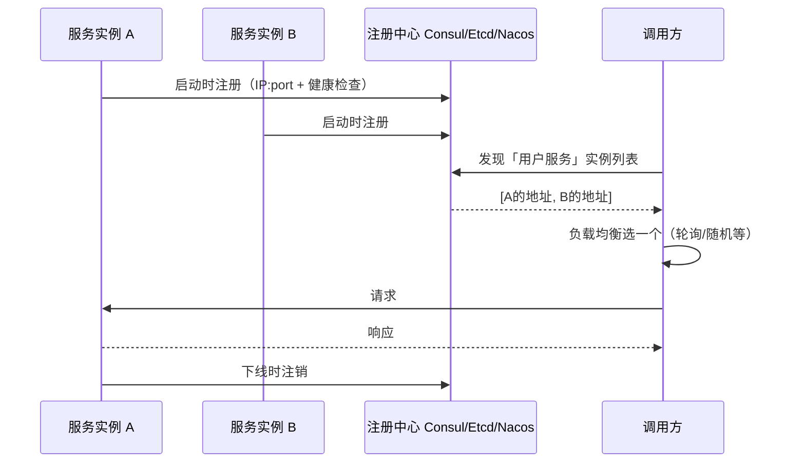
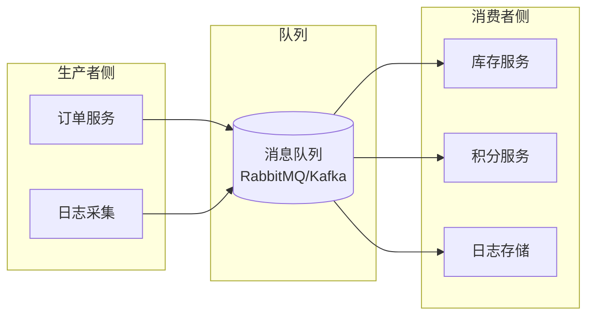

# [7天实战入门Go语言后端] Go 后端技术点讲解与自测要点

**博文链接**：[Go 后端技术点讲解及可能面试题解答](https://blog.csdn.net/weixin_40959890/article/details/158179409)

本文档按**主题**把 Go 后端常见技术点讲清楚，并配上**常见考点与自测时的回答思路**。会明确区分：**本项目里你练到了什么**（对应仓库里的 day0～day7、part2），以及**实际实战与复习时还会遇到的扩展点**（本项目未做或只点到为止）。扩展点部分会**把重点讲清楚、相关内容也涉及并讲清楚**，目标是你**看完能实战无忧**，自我复习时能讲得清、答得上。按「语言 → HTTP → 项目结构 → 数据层 → 测试部署 → 进阶 → 扩展」循序渐进，说人话、有解答。

---

## 怎么用这份文档

| 你现在的目标 | 建议用法 |
| :--- | :--- |
| 学完 7 天 / part2，想复习 | 按下面章节顺序看，每节的「本项目」对着仓库代码过一遍，能讲清「这段在干啥、为什么这么写」。 |
| 做系统复习 | 重点看每节的「可能怎么问」和「怎么答」；扩展点知道概念即可，自测时能说「项目里用了 XX，YY 可以后续加」。 |
| 想往实战/中级靠 | 扩展点**重点会讲清楚**，**相关内容也会涉及并讲清楚**（限流、gRPC、可观测、消息队列、服务发现、配置中心等）；按文档过完、再挑重点做小 demo，目标是**看完实战无忧**，自我复习时能讲得清。 |

**约定**：正文里「本项目」= 本仓库 day0～day7 + part2-projects 已实现的代码；「扩展」= 实战常见、复习时常会自测、本项目未深入或未实现的内容。

### 频段说明与速查

文档按**高频 / 中频 / 低频**标注，方便你按「常考程度」优先查；**中高频内容尽量写足**，随时可当手册查。

| 频段 | 含义 | 建议 |
| :--- | :--- | :--- |
| **高频** | 复习/自测几乎必遇，生产也常用 | 每节都有「要点 + 本项目 + 可能怎么问/怎么答」+ 扩展，优先过一遍 |
| **中频** | 项目里会用到，自测也常问 | 同样写满要点与答法，当手册查「项目结构」「测试部署」「日志可观测」时直接翻对应章 |
| **低频** | 偶尔问或进阶才用 | 正文或第十一节扩展里带过，知道概念与代码位置即可 |

**按主题速查**（想查某一块时直接跳章）：

| 想查的关键词 | 章节 |
| :--- | :--- |
| 错误处理、%w、errors.Is/As | 一、错误处理（高频） |
| goroutine、channel、context、map 并发 | 二、并发（高频） |
| HTTP、路由、gin、响应头、CORS | 三、HTTP（高频）、四、中间件（高频） |
| 中间件、鉴权、JWT、限流、Refresh Token | 四、中间件与鉴权（高频） |
| 优雅关闭、Shutdown、SIGTERM | 五、优雅关闭（高频） |
| 项目结构、cmd/internal、配置、viper、配置中心 | 六、项目结构与配置（中频） |
| 数据库、事务、连接池、防注入 | 七、数据层与事务（高频） |
| 单测、httptest、Docker、多阶段 | 八、测试与部署（中频） |
| 日志、slog、trace_id、Prometheus、可观测 | 九、日志与可观测（中频） |
| gin、JWT、Redis、事务、pprof、统一响应体 | 十、进阶实战（高频） |
| 限流熔断、gRPC、服务发现、消息队列、缓存穿透击穿雪崩 | 十一、实战扩展点汇总 |

---

## 一、错误处理与多返回值（高频）

### 要点

Go 没有 try-catch，错误通过**多返回值**和 **error 类型**显式返回，要求调用方必须处理。这是复习时常考的「Go 错误怎么处理？」的来源。

### 本项目

- **day1/basics**：多返回值、`if err != nil` 先判再用药；用 **`*User` 表示「可能没有」**：查不到时返回 `(nil, nil)` 或 `(nil, ErrNotFound)`，调用方先判 err 再判 nil，避免「查到了零值用户」和「没查到」歧义。
- **day1/errors**：错误包装 `fmt.Errorf("xxx: %w", err)`（必须 %w 不能 %v）；`errors.Is(err, ErrNotFound)`、`errors.As(err, &target)` 判断错误链；可对照「用 %v 包装后 Is/As 失效」理解。

### 可能怎么问 / 怎么答

**Q：Go 里错误怎么处理？**  
答：用多返回值，最后一个一般是 `error`。调用方先判 `if err != nil`，再使用其它返回值。不能忽略 err，否则容易 nil 指针或逻辑错。我们项目里查用户、读配置、连数据库都是先判 err 再往下走。

**Q：怎么包装错误？为什么用 %w？**  
答：用 `fmt.Errorf("操作失败: %w", err)` 把底层错误包一层，方便打日志、区分业务。**必须用 %w**（不能写 %v 或 %s）：只有 %w 会让 Go 保留错误链，`errors.Is(err, ErrNotFound)` 和 `errors.As(err, &target)` 才能**递归展开**包装层，找到里面的原始错误；用 %v 链就断了，Is/As 只能看到最外层这一层，无法识别底层是 ErrNotFound 还是别的类型。本项目 day1/errors 里有对比示例。

**Q：errors.Is 和 errors.As 区别？**  
答：`Is(err, target)` 判断 err 链里**有没有**和 target 相等的错误（用 `==` 比较），适合「是不是某个已知错误」如 `ErrNotFound`。`As(err, &target)` 把链里**第一个可赋给 target 类型的错误**赋给 target，用来做类型断言、取里面的字段（如自定义的 `*ValidationError` 的 Field）。两者都依赖错误链，所以包装时必须用 %w。

### 扩展（实战与复习可能涉及）

- **错误码体系**：业务里常用 code + message，前端按 code 分支提示。part2 的 transaction-pprof-api 有统一响应体与常量（CodeOK、CodeBadRequest 等）；大一点的项目会做错误码表、国际化。设计时注意：0 表示成功，非 0 按区间划分（如 1xxx 系统、2xxx 参数、3xxx 业务）。
- **panic/recover**：panic 会一路向上抛，直到 recover 或进程退出。**业务逻辑不要用 panic 代替 error**，否则调用方无法用 if err 处理。一般只在**启动阶段**用 recover（如配置缺失直接退出），或第三方库可能 panic 时在顶层 recover 打日志。recover 必须在 defer 里调才有效。
- **errgroup**：要**并发执行多步、任一步出错就全部取消**时，用 `golang.org/x/sync/errgroup`。`g, ctx := errgroup.WithContext(ctx)`，然后 `g.Go(func() error { ... })` 投多个任务，最后 `g.Wait()` 会返回**第一个**非 nil 的 error；且 ctx 会在任一子任务出错时被取消，其它子任务可通过 ctx.Done() 退出。比手写 WaitGroup + context 省事。

---

## 二、并发：goroutine、channel、sync（高频）

### 要点

Go 的并发模型是** goroutine + channel**。goroutine 轻量、由运行时调度；channel 用来在 goroutine 之间传数据和做同步。复习时常考「和线程区别」「channel 有缓冲没缓冲」「怎么保证并发安全」。

### 本项目

- **day1/concurrency**：goroutine 启动、channel 收发、select、sync.WaitGroup、sync.Mutex、context 取消与超时。
- **day7/internal/store**：内存 store 用 RWMutex 保护 map，避免多 goroutine 同时写。
- **part2**：Redis、事务等里也有并发场景（如多个请求同时读写）。

### 可能怎么问 / 怎么答

**Q：goroutine 和线程区别？**  
答：goroutine 是用户态、由 Go 运行时调度，创建和切换成本很低，可以开很多个；线程是内核态、由 OS 调度，数量多了成本高。所以我们一般直接 `go func()` 起 goroutine，不会像 C/Java 那样纠结「线程池大小」——但要注意别泄漏（比如不读的 channel、不 cancel 的 context）。

**Q：channel 有缓冲和无缓冲区别？**  
答：**无缓冲**：发送方会**阻塞直到有接收方**取走数据，相当于「同步握手」；常用来做信号、通知。**有缓冲**：发送方可以往 channel 里**塞满容量**后才阻塞，接收方可以滞后取；常用来做队列、削峰。例如 `ch := make(chan int)` 无缓冲，`ch := make(chan int, 10)` 容量 10。本项目 day1/concurrency 里有示例。

**Q：怎么等待多个 goroutine 完成？**  
答：用 `sync.WaitGroup`：主 goroutine `Add(n)`，每个子 goroutine 里 `defer wg.Done()`，主 goroutine `wg.Wait()`。要是「有一个出错就全停」可以用 errgroup。

**Q：怎么保证并发安全？多 goroutine 写同一个 map 会怎样？**  
答：要么用 channel 把写操作串到同一个 goroutine 里，要么用锁。**多 goroutine 直接写同一 map 会 panic**。我们 day7 的 store 用 `sync.RWMutex`：读多写少用 RLock，写用 Lock。

**Q：context 干什么用的？**  
答：用来在请求链路上传「取消信号」和「超时」。比如 HTTP 请求带一个 context，下游查 DB、调 Redis 都传这个 context；请求被取消或超时，context 会 Done，下游可以及时停掉。本项目 day5 有请求超时中间件，day1 有 context 取消示例。

### 扩展

- **channel 关闭**：**谁创建 channel 谁负责 close**，且**只 close 一次**（重复 close 会 panic）。关完后：接收方 `v, ok := <-ch` 会得到零值且 ok=false；`for v := range ch` 会正常退出。**不 close 的话**，若没有别的 goroutine 再发数据，for range 会一直阻塞。向已关闭的 channel 发送会 panic。通常由生产者 close，消费者用 range 或 ok 判断结束。
- **sync.Once**：保证某段逻辑**只执行一次**，多 goroutine 并发调也只会执行一次，常用于单例初始化。`var once sync.Once`，在需要的地方 `once.Do(func() { ... 初始化 ... })`。day7 里若 store 需要懒初始化，可用 Once 包一层。
- **atomic**：对简单数值做**无锁**的读写与加减，如 `atomic.AddInt64(&counter, 1)`、`atomic.LoadInt64(&counter)`。适合高并发下的计数、标志位；比 Mutex 轻量，但不能保护复杂结构体。day7 store 自增 ID 可用 `atomic.AddInt64`。
- **数据竞争检测**：编译时加 `-race`（`go build -race`、`go test -race`），运行时会检测「多 goroutine 同时读写同一变量且无同步」并报错。**上线前**建议在 CI 里跑一遍带 -race 的测试；生产二进制一般不带 -race（有性能开销）。

---

## 三、HTTP 服务与路由（高频）

### 要点

写后端离不开 HTTP：监听端口、解析请求、根据方法和路径分发、写响应。Go 标准库 `net/http` 就能写完整服务；实际项目里很多人用 **gin** 等框架，路由和中间件更顺手。复习时常考「怎么写 HTTP 服务」「标准库和 gin 区别」。

### 本项目

- **day2/server**：`http.ListenAndServe`、`ServeMux` 路由、`HandleFunc`、JSON 编解码、写响应头与 Body。
- **day7**：标准库搭的 REST API（/health、/api/users）、路由精确/前缀匹配（/api/users vs /api/users/）。
- **part2**：两个项目都用 **gin**（路由、c.JSON、中间件）。

### 可能怎么问 / 怎么答

**Q：Go 怎么写一个 HTTP 服务？**  
答：① `mux := http.NewServeMux()`，`mux.HandleFunc("/path", handler)` 注册路径和处理函数。② 处理函数签名 `func(w http.ResponseWriter, r *http.Request)`：里面对 `r.Method`、`r.URL.Path` 分支，先 `w.Header().Set("Content-Type", "application/json")` 再 `w.WriteHeader(code)` 再 `w.Write(body)`（**顺序不能反**）。③ `http.ListenAndServe(addr, mux)` 阻塞监听。我们 day2、day7 都是这么写的。

**Q：响应头顺序有什么坑？**  
答：**必须先设完 Header，再调 WriteHeader 或第一次 Write**；一旦调了 WriteHeader，头就发走了，后面再 Set 就不生效。想返回 JSON 错误时要先 `Set("Content-Type", "application/json")` 再 `http.Error`。本项目 day2、PITFALLS 文档里都有说。

**Q：路由带不带末尾斜杠有什么区别？**  
答：标准库规定：pattern 末尾**有** `/` 是**前缀匹配**（如 `/api/users/` 能匹配 `/api/users/1`）；**没有** `/` 是**精确匹配**。所以列表和详情要分开注册：`/api/users` 和 `/api/users/`，否则详情会 404。

**Q：你们用 gin 还是标准库？gin 和标准库比有啥好处？**  
答：入门项目（Day 7）用的是标准库，能搞清原理；进阶项目（part2）用 gin。gin 路由写法简单（GET/POST 直接挂）、中间件多、绑定 JSON 和参数方便、生态成熟，实际项目里用得很多。标准库更轻、无依赖，适合小工具或对依赖敏感的场景。

### 扩展

- **REST 设计**：资源用**名词**（如 /users、/orders），**HTTP 方法**表示动作：GET 查、POST 建、PUT 全量更新、PATCH 部分更新、DELETE 删。**状态码**要对：200 成功、201 创建成功、400 参数错误、404 资源不存在、500 服务端错误；别所有错误都 200 + body 里写错误。
- **HTTPS、TLS**：生产一般**前面挂 Nginx 或云 LB** 终结 TLS，Go 服务内网跑 HTTP 即可。若 Go 直接对外 HTTPS：`ListenAndServeTLS(certFile, keyFile)`，证书可用 Let's Encrypt 或云厂商；要注意证书续期。
- **echo、chi、fiber**：其它常见 Go Web 框架。echo 轻量、API 和 gin 像；chi 偏标准库风格、路由用 Router；fiber 基于 fasthttp。复习时知道「有这些选择」、能说出一两个区别即可。

---

## 四、中间件与鉴权（高频）

### 要点

中间件 = 在「进到业务 handler」之前/之后统一做一层事：打日志、鉴权、超时、跨域等。实现方式就是**包装 Handler**：外层先干活，再调 `next.ServeHTTP(w, r)`。鉴权常见有 API Key、JWT（Bearer Token）。

### 本项目

- **day5**：Logging 中间件（记耗时、path）、API Key 中间件（读 Header 校验）、Timeout 中间件（context 超时）。
- **day7**：同样的 Logging（slog）、API Key（可选），包在 mux 外面形成链。
- **part2 redis-jwt-api**：**JWT** 中间件（校验 Bearer token、把 claims 放进 context）、gin 的 `Use` 挂到需要鉴权的路由组。

### 可能怎么问 / 怎么答

**Q：中间件怎么实现？**  
答：就是一个函数，入参是 `next http.Handler`，返回一个新的 `http.Handler`。在新 Handler 的 `ServeHTTP` 里先做自己的逻辑（比如查 token），再调 `next.ServeHTTP(w, r)`。这样一层包一层就形成链，请求先过日志、再过鉴权、最后进业务。**请求经过中间件的顺序**（一目了然）：

day5、day7 都有示例。

**Q：怎么实现请求超时？**  
答：用 `context.WithTimeout` 从请求的 context 派生一个带超时的子 context，传给下游；超时后 context 会 Done，下游应检查并停止。我们 day5 有超时中间件，在 handler 里用这个 context 调 DB/Redis。

**Q：API Key 和 JWT 区别？你们用哪种？**  
答：API Key 简单，一般放 Header，服务端查一下是否匹配就行，适合内部或简单场景。JWT 是无状态鉴权：服务端只校验签名和过期时间，不用存 session；适合多实例、前后端分离。本项目 day5/day7 用 API Key 做入门；part2 的 redis-jwt-api 用 JWT（登录接口发 token，需要鉴权的接口校验 Bearer token）。

**Q：JWT 怎么校验？**  
答：① 从 Header 取 `Authorization: Bearer <token>`，没有则 401。② 用和签发时一致的 **secret** 和**算法**（如 HS256）调用库的 Parse/Verify；验签失败或 token 过期（看 exp）则 401。③ 校验通过后把解析出的 **claims**（如 user_id、过期时间）放进 context 或 gin 的 `c.Set("claims", claims)`，后续 handler 用 `c.Get("claims")` 取。我们 part2 用 `golang-jwt/jwt/v5`，中间件里 Parse 后 `c.Set("claims", claims)`。

### 扩展（重点讲清，实战无忧）

**Refresh Token**

- **是什么**：Access Token 短期有效（如 15 分钟），Refresh Token 长期有效（如 7 天）、只用于换新 Access，不直接访问接口。
- **为什么**：Access 泄露影响范围小；Refresh 存 DB 或 Redis，可主动失效（踢人、改密）。
- **实战流程**：登录接口同时返回 access + refresh；前端 access 过期时调「用 refresh 换 access」接口；若 refresh 无效则要求重新登录。服务端换发时可选「refresh 一次性」或「轮转」出新 refresh。
- **可能怎么问**：Q：Access 和 Refresh 区别？答：Access 带在请求头里访问业务，短过期；Refresh 只用来换 Access，长过期、可撤销，泄露风险可控。

**限流（Rate Limiting）**

- **是什么**：限制单位时间内的请求量，防止系统被拖垮或恶意刷接口。
- **常见算法**：**令牌桶**（固定速率往桶里放令牌，请求取到令牌才通过，可应对突发——桶满时短时间内多取几个）；**漏桶**（请求进桶、以固定速率漏出，平滑输出、不应对突发）；**滑动窗口/固定窗口**（按时间窗计数，实现简单，边界可能突刺）。
- **实战**：单机可在中间件里用 `golang.org/x/time/rate`（令牌桶）或自维护计数；多实例要用 **Redis** 做分布式限流（如 INCR + EXPIRE，或 Lua 保证原子性）。按 IP 或 UserID 限流，按接口区分 QPS 配额。
- **可能怎么问**：Q：令牌桶和漏桶区别？答：令牌桶允许一定突发（桶里有就能过），漏桶输出恒定；高 QPS 场景常用令牌桶。Q：分布式限流怎么做？答：用 Redis 计数，key 带时间窗（如 `rate:user:123:2025021810`），INCR 超阈值就 429，并设 TTL。

**CORS（跨域）**

- **是什么**：浏览器同源策略下，前端（如 https://fe.com）请求后端（https://api.com）会跨域，需后端显式返回 `Access-Control-Allow-Origin` 等头，浏览器才把响应交给前端。
- **实战**：响应头加 `Access-Control-Allow-Origin: *` 或具体域名；预检请求（OPTIONS）要单独处理，返回 204 并带上 Allow-Methods、Allow-Headers、Max-Age。可做成中间件，按需放行域名和方法。
- **可能怎么问**：Q：为什么本地调接口没问题，前端一调就跨域？答：浏览器会拦截跨域响应，除非后端返回了 CORS 头；用 Postman/curl 不会触发同源策略，所以不报错。

---

## 五、优雅关闭（高频）

### 要点

进程直接杀掉的话，正在处理的请求会断，客户端可能拿到不完整响应。**优雅关闭** = 收到退出信号（如 Ctrl+C、SIGTERM）后，**不再接新请求**，**等当前正在处理的请求全部结束**再退出。这是生产环境标配，复习时重点掌握。

### 本项目

- **day7/cmd/server/main.go**：`ListenAndServe` 放在 goroutine 里，main 里用 `signal.Notify(quit, SIGINT, SIGTERM)` 和 `<-quit` 等信号，收到后调 `srv.Shutdown(ctx)`，ctx 用 `context.WithTimeout` 设个最大等待时间（如 10 秒）。

### 可能怎么问 / 怎么答

**Q：怎么实现优雅关闭？**  
答：① 用 **goroutine** 跑 `ListenAndServe`（否则 main 阻塞，后面收不到信号）。② 主 goroutine 里 `signal.Notify(quit, syscall.SIGINT, syscall.SIGTERM)` 然后 `<-quit` 阻塞等信号。③ 收到信号后调 `srv.Shutdown(ctx)`，ctx 用 `context.WithTimeout` 设一个**最大等待时间**（如 10 秒）。Shutdown 会**关闭 listener**（不再接新连接），并**等待当前所有活跃请求处理完**再返回；若 ctx 先超时，会返回 ctx 的 error，未处理完的请求可能被中断，但进程可以退出。我们 day7 就是这么做的，复习时可以指着这段讲。

**Q：为什么要用 goroutine 跑 ListenAndServe？**  
答：因为 `ListenAndServe` **阻塞**在 Accept 上，不放到 goroutine 里 main 就卡死在那，后面的 `signal.Notify` 和 `<-quit` 永远执行不到，就没法在收到 Ctrl+C 或 kill 时调 Shutdown。

### 扩展

- **K8s 里**：Pod 被删或滚动更新时，K8s 会向进程发 **SIGTERM**，并等待 **terminationGracePeriodSeconds**（默认 30 秒）后发 SIGKILL。你的进程要在这段时间内完成 Shutdown：收 SIGTERM → 调 Shutdown(ctx)，ctx 超时略小于 grace period，这样既能等请求收尾，又不会拖到被 SIGKILL。
- **连接级超时**：`http.Server` 的 **ReadTimeout**、**WriteTimeout** 要设（如 10～30 秒）。ReadTimeout 从**读完请求头**开始算，包含读 Body 的时间；WriteTimeout 是写响应的最长时间。这样慢客户端或慢响应不会一直占住连接。和**请求级**的 context 超时配合：Server 超时管连接，context 超时管单次请求业务逻辑。

---

## 六、项目结构与配置（中频）

### 要点

项目要可维护、可部署，就得有清晰目录划分和配置方式。常见做法是 **cmd/** 放入口、**internal/** 放业务、配置从环境变量或配置文件读，敏感信息不写进代码。

### 本项目

| 内容 | 位置 |
| :--- | :--- |
| 入口与分层 | day3、day7、part2 均为 `cmd/server` + `internal/config`、`handler`、`store`、`middleware` |
| viper + 环境变量 | day3/internal/config、main 里 viper.BindEnv / AutomaticEnv |
| .env 加载顺序 | day3：main 里先 godotenv.Load 再 viper.Load，否则读不到 .env |
| part2 配置 | part2-projects/*/internal/config：HTTP_PORT、JWT_SECRET、REDIS_ADDR、SQLITE_DSN 等 |

### 可能怎么问 / 怎么答

**Q：你们项目结构怎么划分？**  
答：按 Go 常见习惯：`cmd/` 下每个子目录是一个可执行入口（如 cmd/server）；`internal/` 下按职责分包，比如 config、handler、store、middleware，避免循环依赖、对外只暴露需要暴露的。我们 day7、part2 都是这种结构。

**Q：配置怎么管理？敏感信息怎么办？**  
答：用环境变量或配置文件，不把密码、密钥写进代码。我们 day3 用 viper 读环境变量和默认值；本地开发用 .env + godotenv，.env 不提交 Git，用 .env.example 做模板。生产环境用 K8s Secret、云厂商密钥等把变量注入进去。

**Q：依赖注入怎么做？**  
答：我们没用复杂 DI 框架，就是**构造时注入**：handler 要用的 store、config 在 main 里 New 好，传给 handler 结构体。这样测试时可以传 mock。day7 的 UserHandler 持有一个 Store，part2 的 handler 持有一个 Store 或 Redis 客户端，都是这种写法。

**Q：.env 和 viper 谁先加载？**  
答：必须先 **godotenv.Load(".env")** 再调 viper 读配置，因为 viper 的 AutomaticEnv 读的是**当前进程环境变量**；godotenv 会把 .env 里的键值注入到环境变量，顺序反了 viper 就读不到。详见 PITFALLS 五、配置与部署。

**Q：internal 包有什么限制？**  
答：Go 规定 `internal` 下的包只能被**同一模块内的父目录及子目录**引用，不能被外部项目 import，这样有利于封装实现细节、避免循环依赖。

### 扩展（重点讲清，实战无忧）

**多环境（dev/test/prod）**

- **是什么**：同一套代码在不同环境用不同配置（DB 地址、日志级别、开关等），通过环境变量或配置文件区分。
- **实战**：用 `APP_ENV` 或 `ENV` 区分，viper 根据其值加载对应文件（如 `config.dev.yaml`）或不同 env 前缀；敏感项用环境变量覆盖，不写进配置文件。部署时由 CI/K8s 注入 ENV 和 Secret。
- **可能怎么问**：Q：多环境配置怎么管？答：用环境变量标识环境，配置按环境加载；敏感信息不落盘，由部署平台注入。

**配置中心（Nacos、Apollo 等）**

- **是什么**：把配置集中存到中心服务，应用启动或定时拉取；支持多服务共享、权限控制、**热更新**（改完配置不重启进程即可生效）。
- **为什么**：多实例、多服务时，改一个配置要登每台机器改文件不现实；配置中心改一次，所有实例拉取或监听变更即可。
- **实战要点**：应用启动时从配置中心拉一份配置并缓存在内存；可配合 long polling 或 watch 做变更推送。要有本地默认/兜底，避免配置中心挂了起不来。Nacos/Apollo 都提供 Go SDK，按 namespace、dataId 区分业务和环境。
- **可能怎么问**：Q：配置中心和本地配置文件区别？答：配置中心集中管理、支持热更新、多服务共享，适合微服务；本地文件简单，单机或小项目够用。Q：配置中心挂了怎么办？答：本地缓存上一份成功拉取的配置，并做健康检查与降级，避免因配置中心不可用导致服务不可用。

---

## 七、数据层与事务（高频）

### 要点

Go 用 **database/sql** 抽象数据库，驱动用 sql.Open 注册。查询用 **预编译 + 参数化** 防 SQL 注入；多步写操作要用**事务**（Begin → 多步 Exec/Query → Commit，出错则 Rollback）保证一致性。复习时常考「怎么连数据库」「怎么防注入」「事务怎么用」。

### 本项目

- **day4**：`sql.Open`、`Query`/`Exec`、预编译语句、SQLite（modernc）和 PostgreSQL（lib/pq）。
- **part2 transaction-pprof-api**：SQLite + **事务**（Transfer：扣款、加款在一个 tx 里，任一步失败 Rollback），以及**统一响应体**（code/message/data）。

### 可能怎么问 / 怎么答

**Q：Go 怎么连数据库？**  
答：用标准库 **database/sql**。① 先 `import _ "驱动"`（如 `_ "github.com/lib/pq"`）做 **side-effect 注册**驱动。② `db, err := sql.Open("postgres", dsn)` 得到 `*sql.DB`，Open 本身**不建连接**，只是准备好；真正用 Query/Exec 时才从**连接池**取连接，用完后归还。③ 用 `db.Query`、`db.Exec`、`db.QueryRow` 等；预编译用 `db.Prepare` 或直接传占位符。我们 day4 的 sqlite 和 postgres 都是这么连的。

**Q：怎么防 SQL 注入？**  
答：**永远不要用 fmt 或字符串拼接把用户输入拼进 SQL**。一律用**占位符 + 参数**：`db.Exec("UPDATE users SET name=? WHERE id=?", name, id)`（MySQL 用 `?`，Postgres 用 `$1,$2`），让驱动做转义。这样即使用户输入里带引号或分号也不会变成多句 SQL。我们 day4、part2 里所有 SQL 都是参数化的。

**Q：事务怎么用？**  
答：`tx, err := db.BeginTx(ctx, nil)`，然后在 tx 上做多步 Exec/Query，都成功就 `tx.Commit()`，任一步失败就 `tx.Rollback()`。一般用 `defer tx.Rollback()`，Commit 之后 Rollback 是 no-op。**事务内多步操作**（以转账为例）：

我们 part2 的 Transfer（转账）就是典型：先查余额、再扣款、再加款，全在同一个 tx 里。

**Q：连接池怎么配置？**  
答：`db.SetMaxOpenConns`、`SetMaxIdleConns`、`SetConnMaxLifetime`，根据压测和数据库承载能力调。不设的话用默认值，一般开发够用。

### 扩展

- **sqlx**：在 database/sql 上包一层，`Get`/`Select` 直接把行扫进结构体，少写多行 `Scan`；`NamedExec` 用 map 或结构体绑命名参数，SQL 可读性好。适合「手写 SQL 但不想手写 Scan」的场景。
- **ORM（如 GORM）**：表结构即结构体、自动建表、链式 API、关联与预加载。适合 CRUD 多、表结构常变的项目。注意：复杂查询要会看生成 SQL，避免 **N+1**（循环里查关联）和全表扫；很多公司仍用手写 SQL 或 sqlx。
- **事务里注意**：① context 超时或取消后，要保证 **tx 被 Rollback**，连接才能归还池子；所以一般 `defer tx.Rollback()`，Commit 后 Rollback 是 no-op。② 别在 tx 里做长时间阻塞（如调外部 HTTP），否则锁持有久、影响其它请求。
- **迁移（migrate）**：表结构变更（加列、加索引）用**版本化迁移脚本**（up/down），用 golang-migrate 等工具执行；**不手改生产库**。发布流程里先跑迁移再部署新版本，保证代码和表结构一致。

---

## 八、测试与部署（中频）

### 要点

单测用 **testing** 包，表驱动（多组输入+期望）写起来清晰；测 HTTP 不用真起服务，用 **httptest** 造 Request 和 Recorder，把 Handler 当函数测。部署常见用 **Docker** 多阶段构建打小镜像。

### 本项目

| 内容 | 位置 |
| :--- | :--- |
| 表驱动单测 | day6/handler/*_test.go：多组输入+期望，for 循环断言 |
| httptest 测 Handler | day6：NewRequest + NewRecorder，传 Handler，断言 rec.Code、rec.Body |
| Docker 多阶段 | day6/Dockerfile：builder 阶段编译，最终阶段只拷二进制 + ca-certificates |
| 运行单测 | `go test ./day6/...`、`go test -v ./day6/...` |

### 可能怎么问 / 怎么答

**Q：Go 怎么写单测？**  
答：同包下写 `xxx_test.go`，函数名 `TestXxx(t *testing.T)`。用**表驱动**：定义一个结构体切片，每行是「输入 + 期望输出」，for 循环里调被测函数，用 `if got != want { t.Errorf(...) }` 或 testify 的 `assert.Equal` 断言。改用例只需改表里一行。我们 day6 的 handler 测试就是这么写的。

**Q：怎么测 HTTP 接口不真正起服务？**  
答：用 `httptest.NewRequest(method, url, body)` 造 `*http.Request`，`httptest.NewRecorder()` 得到会录下写入内容的 ResponseWriter；把这两个传给你的 Handler，Handler 像平时一样 `w.WriteHeader`、`w.Write`；测完用 `rec.Code`、`rec.Body.String()` 做断言。**不占端口、不跑网络**，速度快，适合 CI。

**Q：Docker 镜像怎么打？**  
答：我们 day6 用多阶段：第一阶段用 golang 镜像编译出二进制，第二阶段用 alpine 之类的小镜像，只把二进制和 ca-certificates 拷进去，这样最终镜像小、没有源码和编译器。生产一般再配合健康检查、非 root 用户等。

**Q：表驱动测试怎么写？**  
答：定义一个结构体切片，每行是「输入 + 期望输出」，for 循环里调被测函数再比较结果；改用例只需改表里的一行，可读性好。day6 handler 测试就是这种写法。

**Q：怎么测需要鉴权的接口？**  
答：在 NewRequest 里带上 Header（如 `Authorization: Bearer <token>`），或先调登录接口拿到 token 再组请求；单测里也可以 mock 鉴权中间件、直接给 context 里塞 claims。

### 扩展

- **testify**：assert/require 让断言更易读，`assert.Equal(t, expect, actual)`。
- **mock**：handler 依赖 store 时，可以定义一个 Store 接口，单测里传一个假实现（返回固定数据），不依赖真实 DB。
- **集成测试**：需要真实 DB/Redis 时，用 testcontainers 或 CI 里起一个临时服务再测。
- **benchmark**：`func BenchmarkXxx(b *testing.B)`，`go test -bench=.`，配合 pprof 看性能。（低频但会考：见下文「低频考点」。）

---

## 九、日志与可观测（中频）

### 要点

线上排查问题靠日志和监控。Go 1.21 起标准库有 **slog**，结构化（key-value）打日志，便于采集和检索。请求日志（method、path、耗时）是标配。

### 本项目

| 内容 | 位置 |
| :--- | :--- |
| 请求日志（method、path、耗时） | day5、day7 的 Logging 中间件，slog.Info key-value |
| slog 结构化 | day7/internal/middleware/logging.go |
| 优雅关闭时的日志 | day7/cmd/server/main.go：shutting down、server stopped |
| 级别 | 生产一般只开 Info 及以上，Debug 排查时再开 |

### 可能怎么问 / 怎么答

**Q：有没有用过结构化日志？**  
答：用过，Go 1.21 的 slog。用 key-value 打，比如 `slog.Info("request", "method", r.Method, "path", r.URL.Path, "duration_ms", duration)`，输出方便被日志系统解析和检索，比 `log.Printf` 拼字符串好维护。我们 day7 的 Logging 中间件就是这么打的。

**Q：日志级别怎么选？**  
答：Debug 开发/排查用，Info 正常请求与关键操作，Warn 可恢复的异常，Error 需关注的错误。生产通常只开 Info 及以上，避免日志量过大。

**Q：怎么根据一次请求查全链路日志？**  
答：入口生成 trace_id 放进 context 或 Header，全链路打日志都带上 trace_id；在日志系统里按 trace_id 检索即可。见本节扩展「trace_id」与第十一节可观测汇总。

### 扩展（重点讲清，实战无忧）

**日志级别与规范**

- **级别**：Debug/Info/Warn/Error；生产一般只开 Info 及以上，Debug 只在排查时临时打开。
- **规范**：关键操作（登录、下单、错误）必须打；避免打敏感信息（密码、完整 token）；结构化 key-value 便于检索，slog 已满足。

**trace_id（请求链路标识）**

- **是什么**：每个请求在入口（中间件或网关）生成唯一 **trace_id**（及 span_id），放进 context，全链路日志都带上，便于在一次请求的所有日志里 grep 或检索。
- **请求在各层透传 trace_id**（示意）：

- **实战**：中间件里 `traceID := uuid.New().String()`（或从上游 Header 透传），`ctx = context.WithValue(ctx, "trace_id", traceID)`，打日志时 `slog.Info("...", "trace_id", traceID)`；调用下游 HTTP/gRPC 时把 trace_id 放进 Header，下游继续透传，形成**分布式链路**。
- **可能怎么问**：Q：怎么排查「一个请求到底经过了哪些服务、卡在哪」？答：用 trace_id 串起全链路日志；再配合 APM/tracing（见下）看调用链和耗时。

**可观测三支柱：日志 + 指标 + 链路**

- **日志（Logging）**：离散事件、错误、业务记录，本项目用 slog 已覆盖；生产会投到 ELK/Loki 等，按 trace_id 检索。
- **指标（Metrics）**：数值型、可聚合，如 QPS、延迟分位、错误率。用 **Prometheus**：服务暴露 `/metrics`，Prometheus 定时拉取；Go 里用 `prometheus/client_golang` 定义 Counter/Gauge/Histogram，在中间件里打请求耗时、按 path 统计。告警基于 Prometheus 查询（如 error_rate > 0.01）触发。
- **链路（Tracing）**：一次请求跨多服务、多函数，每个「 span」记开始/结束和父子关系，形成调用树。**OpenTelemetry** 是统一标准：在框架/HTTP/gRPC 里插桩，生成 span、带 trace_id，导出到 Jaeger/Zipkin 等后端，看火焰图、慢调用。
- **三者关系**（下图帮助记忆）：

实战里三者都上，用 trace_id 把同一次请求的 log 和 trace 串起来。
- **可能怎么问**：Q：可观测一般做哪些？答：日志、指标、链路；我们项目用了 slog 做日志，指标和链路可以用 Prometheus + OpenTelemetry 接上。Q：Prometheus 和 OpenTelemetry 区别？答：Prometheus 管指标（拉模型）；OpenTelemetry 管链路（及统一埋点标准），可同时导出 metrics，两者可配合使用。

---

## 十、进阶实战：gin、JWT、Redis、事务、pprof（高频）

### 要点

这部分对应**本项目的 part2**：用 **gin** 写两个小项目，一个接 **JWT + Redis**，一个接**事务 + 统一响应体 + pprof**。复习或自测时会问到「用啥框架」「缓存怎么做的」「事务怎么写的」「性能问题怎么排查」等，都可以往这里靠。

### 本项目

| 项目 | 技术点 | 代码/文件位置 |
| :--- | :--- | :--- |
| **redis-jwt-api** | gin 路由、JWT 签发与校验 | cmd/server/main.go 路由与 protected 组；internal/handler/auth.go Login；internal/middleware/jwt.go |
| **redis-jwt-api** | Redis 缓存、写后删 | internal/store/cache.go List/Create（Cache-Aside + 写后 Delete）；redis_cache.go Get/Set/Delete |
| **redis-jwt-api** | 限流（可选）、请求体验证 | internal/middleware/ratelimit.go；handler users Create 里 name 长度校验 |
| **transaction-pprof-api** | 事务转账、统一响应体 | internal/store/sqlite.go Transfer；internal/resp/resp.go、handler 里 resp.OK/Fail |
| **transaction-pprof-api** | 错误码常量、pprof | internal/resp/resp.go CodeOK/CodeBadRequest 等；main 挂 /debug/pprof |

### 可能怎么问 / 怎么答

**Q：统一错误码 / 响应体怎么设计？**  
答：我们约定所有接口返回 `{ "code": 0, "message": "ok", "data": ... }`，code 非 0 表示业务或参数错误，前端根据 code 做提示。错误时 `data` 可省略或放错误详情。part2 的 transaction-pprof-api 里有完整示例，handler 里统一用 `resp.OK(data)` / `resp.Fail(code, msg)`。

**Q：Redis 怎么用的？缓存穿透/击穿了解吗？**  
答：我们 part2 用 go-redis 连 Redis，把「用户列表」缓存一份，读时先查缓存，miss 再查 DB 并回填。**缓存穿透**是查不存在的数据，请求都打到 DB，可以用空值缓存或布隆过滤器；**击穿**是热点 key 过期瞬间大量请求打到 DB，可以用互斥锁或逻辑过期。项目里做了简单缓存，这些优化可以后续加。

**Q：性能问题怎么排查？**  
答：① **pprof**：服务暴露 `/debug/pprof/profile`（CPU）和 `/debug/pprof/heap`（内存）。本地 `go tool pprof http://localhost:8081/debug/pprof/profile?seconds=30` 采 30 秒 CPU，进入后 `top` 看占用、`web` 看火焰图（需 graphviz）；heap 同理看谁在分配。② 先**压测**（如 wrk）复现高负载，再采样更准。③ 配合 **benchmark**（`go test -bench=.`）看单函数耗时。我们 part2 的 transaction-pprof-api 已挂 pprof，见项目 README「pprof 使用步骤」。

### 扩展（重点讲清，实战无忧）

**请求体验证（validator）**

- **是什么**：对请求体/查询参数做格式与业务校验（必填、长度、范围、格式），避免脏数据进业务。gin 的 binding 可配合 **go-playground/validator**。
- **实战**：结构体字段加 tag，如 `binding:"required"`、`validate:"max=100"`；在 handler 里 `c.ShouldBindJSON(&req)` 后若 err 则返回 400；复杂规则可手写校验函数。统一在中间件或 handler 入口校验，避免每个业务重复写 if。
- **可能怎么问**：Q：参数校验怎么做？答：用 validator 的 tag 做基础校验，业务规则在 handler 或 service 里再判一层；校验失败统一返回 400 和明确错误信息。

**API 文档（Swagger/swaggo）**

- **是什么**：用注释描述接口（路径、方法、请求/响应体），通过 **swaggo** 生成 OpenAPI 文档和 Swagger UI 页面，前后端按文档联调。
- **实战**：在 handler 或 main 上写 `// @Summary xxx`、`// @Router /api/xxx [post]` 等，运行 `swag init` 生成 docs；gin 里挂 `ginSwagger.WrapHandler` 暴露 `/swagger/index.html`。接口变更后记得重新 `swag init`。
- **可能怎么问**：Q：你们 API 文档怎么维护？答：用 swaggo 根据注释生成，和代码一起更新，避免文档和实现不一致。

**熔断（Circuit Breaker）**

- **是什么**：调用下游（DB、RPC、HTTP）时，若失败率或错误数超过阈值，**熔断器**打开，后续请求直接失败或走降级，不再打挂掉的下游，避免雪崩；过一段时间后进入半开，试探性放行少量请求，成功则关闭熔断。
- **和限流区别**：限流是「请求太多就拒」；熔断是「下游不行就停调，保护自己」。
- **状态机**（一目了然）：

- **实战**：可用 **hystrix-go**、**sony/gobreaker** 或自实现；对关键下游（支付、风控）建议加熔断和超时。
- **可能怎么问**：Q：熔断和限流区别？答：限流控制自身入口流量；熔断是下游不可用时主动断开调用，防止拖垮自己。Q：熔断器有哪几种状态？答：关闭（正常调用）、打开（直接失败/降级）、半开（试探放行）。

**gRPC 与内部服务调用**

- **是什么**：基于 HTTP/2、用 **Protocol Buffers** 定义消息和服务，二进制序列化，多路复用单连接，支持单向/双向流。适合**服务间**高性能、强类型调用。
- **和 HTTP/JSON 对比**：gRPC 二进制、更省带宽、多路复用、流式；HTTP/JSON 人类可读、易调试、浏览器直接调。一般**对外 REST、对内 gRPC**。
- **实战要点**：写 `.proto` 定义 service 和 message，用 `protoc` 生成 Go 代码；服务端实现生成出来的 interface，注册到 gRPC Server；客户端用生成的 client 调。要配合 **服务发现**（见第十一节）做多实例调用；超时、重试、熔断同样要做。
- **可能怎么问**：Q：为什么微服务内部用 gRPC？答：二进制省带宽、多路复用、流式适合大包或长连接，强类型和代码生成减少手写解析错误。Q：gRPC 和 HTTP 区别？答：gRPC 基于 HTTP/2、二进制、有流；HTTP/JSON 基于 HTTP/1.x 常见、文本、无状态请求响应。

---

## 十一、实战扩展点汇总（重点讲清，实战无忧）

下面这些在**真实项目与复习自测**里常出现，本项目要么没做要么前面只点到为止。本节把**重点和相关内容都讲清楚**，你看完能带着理解去选型、做方案、自测时答得上来；再按需做小 demo 即可实战无忧。

---

### 11.1 数据层：sqlx、GORM、迁移

**sqlx**：在 `database/sql` 上包一层，`Get`/`Select` 直接把行扫进结构体，少写 `Scan` 样板；`NamedExec` 用 map 或结构体绑命名参数，可读性好。适合「手写 SQL 但不想手写 Scan」的场景，很多团队选它而不是重 ORM。和标准库一样用 `?` 或 `$1` 占位符防注入。

**GORM**：完整 ORM，表结构即结构体、自动建表、链式 API、关联与预加载。适合业务以 CRUD 为主、表结构常变、团队习惯 ORM 的项目。注意：① 复杂查询要会看**生成的 SQL**，避免 N+1（循环里查关联）和全表扫；② 性能敏感处可切回手写 SQL 或 sqlx。

**迁移（migrate）**：表结构变更（加列、加索引、改类型）用**迁移脚本**管理，**不手改生产库**。每份迁移有**版本号**、**up**（执行）和 **down**（回滚），用 golang-migrate 等按顺序执行。**上线顺序**：先执行迁移（保证库结构是新版本要的），再部署新版本进程；这样进程启动时不会因缺列或类型不对报错。新项目建议一开始就上迁移，别等出问题再补。

**可能怎么问**：Q：sqlx 和 GORM 怎么选？答：要灵活、可控、少魔法用 sqlx；要开发效率、CRUD 多、团队熟 ORM 用 GORM。Q：表结构变更怎么上线？答：用迁移工具写好 up/down，发布时**先跑迁移再部署**，避免新代码配旧表结构。

---

### 11.2 缓存：击穿、穿透、雪崩与分布式锁

**三种问题对比**（先看图再记解法）：

**缓存穿透**：查**不存在的数据**，请求每次都穿过缓存打到 DB。解决：① **空值缓存**：查不到也写一份空/占位到缓存，TTL 设短一点；② **布隆过滤器**：在缓存前加一层，一定不存在的 key 直接挡掉，存在再查缓存和 DB。

**缓存击穿**：**热点 key 过期**的瞬间，大量请求同时打到 DB。解决：① **互斥锁**：只有一个请求去查 DB 并回填，其他等；② **逻辑过期**：缓存里存「逻辑过期时间」，物理不删，后台异步刷新，读时若逻辑过期则触发一次刷新并可能用旧值先返回。

**缓存雪崩**：大量 key **同时过期**或 **缓存挂了**，流量全打 DB。解决：① TTL 加随机偏移，避免同时失效；② 多级缓存（本地 + Redis）；③ 限流 + 熔断，保护 DB；④ Redis 集群、高可用。

**分布式锁**：多实例要「同一时刻只有一个执行某任务」时用。常见用 **Redis SET key value NX EX seconds**：谁先 SET 成功谁抢到锁，执行业务后 **DEL**；**必须设过期**（EX）避免进程挂掉导致死锁。DEL 时最好用 **Lua** 脚本「只删 value 等于自己那次 SET 的」避免删掉别人续期后的锁。**续期**：若业务可能超过 EX 时间，可用「看门狗」goroutine 定时续 EX，或业务分段、锁只护短任务。Redlock 是多 Redis 实例的加强版，争议较多，一般单 Redis + 合理过期即可。**可重入**：value 存唯一标识（如 UUID），同一进程再次抢锁时若 value 匹配可视为已持有。

**可能怎么问**：Q：穿透、击穿、雪崩分别是什么、怎么解决？答：穿透是查不存在→空值缓存或布隆过滤器；击穿是热点 key 过期→互斥或逻辑过期；雪崩是大量 key 同时失效或缓存挂→TTL 随机、多级缓存、限流熔断。Q：分布式锁用 Redis 怎么做？答：SET NX EX 抢锁，业务完 DEL；value 存唯一标识，DEL 时校验，避免删别人锁；必须设过期防死锁。

---

### 11.3 鉴权扩展：Refresh Token、OAuth

**Refresh Token**：前面第四节扩展已讲——Access 短、Refresh 长、用 Refresh 换 Access，可撤销。实战要决定 Refresh 是否一次性、是否轮转，以及存 DB/Redis 便于踢人。

**OAuth 2.0**：第三方登录（用微信/GitHub 登录你的应用）。角色：**资源拥有者**（用户）、**客户端**（你的前端）、**授权服务器**（微信等）、**资源服务器**（用户信息接口）。常见**授权码流程**（下图）：

实战用现成库对接各平台，注意 state 防 CSRF、token 存好不泄露。

**可能怎么问**：Q：OAuth 里 code 和 token 区别？答：code 是授权码，一次性的，后端用 code 去换 access_token；code 在回调里传，不直接给前端 token，更安全。

---

### 11.4 HTTP 与部署细节：CORS、HTTPS、超时

**CORS**：浏览器同源策略下，跨域请求需要后端显式返回 CORS 头，否则响应会被浏览器拦截。① 响应头加 `Access-Control-Allow-Origin`（生产建议写具体域名如 `https://fe.example.com`，不写 `*`）。② **预检请求**：浏览器在发跨域非简单请求前会先发 **OPTIONS**，后端要识别 OPTIONS 并返回 204，同时带上 `Access-Control-Allow-Methods`、`Access-Control-Allow-Headers`、`Access-Control-Max-Age`。可做成中间件，按域名和方法放行。

**HTTPS/TLS**：生产一般 **Nginx 或云 LB** 终结 TLS，Go 服务内网跑 HTTP 即可。若 Go 直接对外 HTTPS：`ListenAndServeTLS(certFile, keyFile)`；证书来源：Let's Encrypt（免费、需自动续期）、云厂商（如阿里云 SSL）、或自签（仅内网）。要关注证书过期与续期。

**连接级超时**：`http.Server` 的 **ReadTimeout**、**WriteTimeout** 必须设（如 10～30 秒）。ReadTimeout 从**读完请求头**开始算，包含读 Body；WriteTimeout 是写响应的最长时间。这样慢客户端或慢 handler 不会一直占住连接。和**请求级** context 超时的关系：Server 超时管「连接占用」，context 超时管「单次请求业务逻辑」；两者配合使用。K8s 里 **terminationGracePeriodSeconds** 要设得**大于**你 Shutdown(ctx) 里 ctx 的超时时间，否则可能还没 Shutdown 完就被 SIGKILL。

---

### 11.5 可观测：日志、指标、链路（汇总）

**日志**：结构化 key-value（slog）、请求级 trace_id 全链路带上；生产投到 ELK/Loki，按 trace_id 检索。**指标**：QPS、延迟分位、错误率，用 Prometheus 暴露 `/metrics`，拉模型；告警基于查询（如 error_rate > 0.01）。**链路**：一次请求跨多服务，用 OpenTelemetry 插桩生成 span，导出到 Jaeger/Zipkin，看调用树和慢调用。三者用 **trace_id** 串联：先看指标定位「哪段时间有问题」，再根据 trace 看「请求经过哪些服务、卡在哪」，再按 trace_id 查日志看具体错误。详细概念与答法见**第九节扩展**。

---

### 11.6 稳定性：限流、熔断、超时与重试（汇总）

**限流**：控制单位时间请求量，保护自己不被拖垮。算法：令牌桶（可突发）、漏桶（平滑）、滑动窗口。单机用 `golang.org/x/time/rate` 或自维护计数；多实例用 **Redis** INCR + EXPIRE 或 Lua。在中间件里做，按 IP 或 UserID、按接口设不同 QPS。详见**第四节扩展**；part2 redis-jwt-api 有单机限流中间件示例。

**熔断**：下游失败率/错误数超阈值时**打开**，后续请求直接失败或降级，不再打挂掉的下游；过一段时间**半开**试探，成功则**关闭**。和限流区别：限流是「请求太多就拒」，熔断是「下游不行就停调」。详见**第十节扩展**（含状态机图）。

**超时**：所有**下游调用**（DB、Redis、HTTP、gRPC）都必须带**超时**（`context.WithTimeout(parent, 3*time.Second)`），避免一个慢下游拖死整进程。从**入口请求**的 `r.Context()` 开始，层层传递 context，到最底层设合理 timeout（如 DB 3s、RPC 1s）。超时后 ctx.Done() 会 close，下游应检查并停止，并把连接/资源释放。

**重试**：下游临时失败（网络抖动、5xx）可重试，但要**有限次数**（如 3 次）+ **退避**（如指数退避 100ms、200ms、400ms），且只有**幂等**操作才可安全重试；写操作要么保证幂等（如带 idempotency key），要么慎用重试。不要无限制重试导致雪崩。

**可能怎么问**：Q：超时和重试怎么配合？答：**先设单次超时**，超时算一次失败；重试时用**新的 context、新的超时**，总耗时 ≈ 重试次数 × 单次超时 + 退避时间，要设**总上限**（如最多 10 秒），避免一次请求拖太久。

---

### 11.7 RPC 与服务发现

**gRPC**：第十节扩展已讲——二进制、多路复用、流式、适合内部服务调用；proto 定义、生成代码、配合超时与熔断。

**服务发现**：多实例部署时，调用方怎么知道下游有哪些实例、地址是什么？**服务发现** = 实例启动时向**注册中心**注册（如 IP:port、健康检查），下线时注销；调用方从注册中心**发现**实例列表，再做负载均衡（轮询、随机、一致性哈希等）。**流程示意**：

常见组件：**Consul**、**Etcd**、**Nacos**（兼配置中心）。K8s 里可用 **Kubernetes Service** 做服务发现，无需自建。实战：gRPC 客户端从服务发现拿到多个 address，选一个或按策略调用；要配合健康检查，剔除不健康实例。

**可能怎么问**：Q：服务发现解决什么问题？答：多实例动态扩缩，调用方不写死 IP，从注册中心拉列表并做负载均衡。Q：和配置中心区别？答：配置中心管配置项；服务发现管「谁在提供某服务」的实例列表。

---

### 11.8 消息队列：异步解耦、削峰、可靠性

**是什么**：生产者发消息到队列，消费者异步消费；双方通过队列解耦，不必同时在线。**整体模型**：

**典型场景**：① **异步**：下单后发消息，库存、积分等异步消费，接口快速返回；② **解耦**：订单和积分服务通过队列通信，不直接 HTTP 调用；③ **削峰**：秒杀请求先写队列，消费者按能力慢慢处理，避免瞬时打爆 DB；④ **可靠性**：消息持久化，消费失败可重试或进死信队列。

**常见组件**：**RabbitMQ**（AMQP、功能全、易用）；**Kafka**（高吞吐、日志/流式、分区顺序）。选型：业务消息、需要复杂路由/延迟用 RabbitMQ；日志采集、大数据、超高吞吐用 Kafka。

**消费语义**：**at most once**（可能丢）、**at least once**（可能重，要幂等）、**exactly once**（难，依赖事务或幂等+去重）。实战多数选 at least once + 业务幂等。

**可能怎么问**：Q：为什么用消息队列？答：异步、解耦、削峰；下单和发积分解耦，下单接口只发消息快速返回，积分服务异步消费。Q：Kafka 和 RabbitMQ 区别？答：Kafka 高吞吐、分区、适合日志和流；RabbitMQ 功能多、路由灵活、适合业务消息。Q：消息重复怎么办？答：消费端做幂等（如唯一键、状态机），at least once 下重复不可避免，靠业务保证结果正确。

---

### 11.9 低频但会考

以下考点出现频率较低，但复习时可能被问到，**知道概念与代码位置即可**，便于手册查全。

| 考点 | 一句话答法 | 本项目/文档位置 |
| :--- | :--- | :--- |
| **sync.Once** | 只执行一次，如单例初始化；`once.Do(func(){...})` | 二、并发 扩展；day7 store 自增可用 Once 保证只初始化一次 |
| **atomic** | 简单计数/标志位无锁，如 `atomic.AddInt64`、`Load/Store` | day7 store 自增 ID 可用 atomic；二、并发 扩展 |
| **-race 数据竞争** | `go build -race`、`go test -race` 检测并发写同一变量 | 二、并发 扩展；上线前建议测一遍 |
| **benchmark** | `func BenchmarkXxx(b *testing.B)`，`go test -bench=.`，配合 pprof | 八、测试 扩展；part2 transaction-pprof-api README pprof 步骤 |
| **迁移 migrate** | 表结构变更用版本化脚本 up/down，不手改生产库 | 十一、11.1 数据层；golang-migrate |
| **errgroup** | 多 goroutine 任一出错即取消，`golang.org/x/sync/errgroup` | 一、错误处理 扩展 |
| **panic/recover** | 一般只在启动时用；业务逻辑用 error，不用 panic 代替 | 一、错误处理 扩展 |
| **channel 关闭** | 谁创建谁关、只关一次；关后接收方零值+ok=false，range 退出 | 二、并发 扩展 |
| **REST 状态码** | 200/201/400/404/500 用对，资源用名词、方法表示动作 | 三、HTTP 扩展 |
| **ReadTimeout/WriteTimeout** | http.Server 设连接级超时，避免慢请求占住连接 | 五、优雅关闭 扩展；PITFALLS 1.4 |

---

## 十二、复习时怎么用本项目

1. **按主题过代码**：从「错误处理」到「进阶实战」，每节对着「本项目」列出的目录把代码看一遍，能口头讲清「这段在干啥、为什么这么写」。
2. **梳理项目要点**：Day 7 可总结为「一个用标准库写的 REST API，带配置、中间件、内存存储和优雅关闭」；part2 可总结为「用 gin 做了带 JWT 和 Redis 缓存的接口」或「用 gin 做了带数据库事务和 pprof 的转账示例」。
3. **扩展点不慌**：文档第十一节和各节「扩展」已把限流、熔断、gRPC、服务发现、配置中心、可观测、消息队列等**重点和相关内容讲清楚**；自测或被问到时可说「项目里用了 XX，YY 在文档里学过，能讲清概念和方案」，再按本节内容答。
4. **踩坑可讲**：常见坑和解法在 [PITFALLS_AND_SOLUTIONS.md](PITFALLS_AND_SOLUTIONS.md)（[博文：踩坑与解法手册](https://blog.csdn.net/weixin_40959890/article/details/158179442)），复习时可以说「在练手项目里遇到过 XX 坑，用 YY 解决」，并指向具体 day 或文件。

整体课程与技术栈见根目录 [README.md](../README.md#课程规划与技术栈)。
