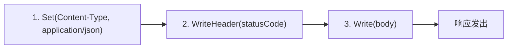
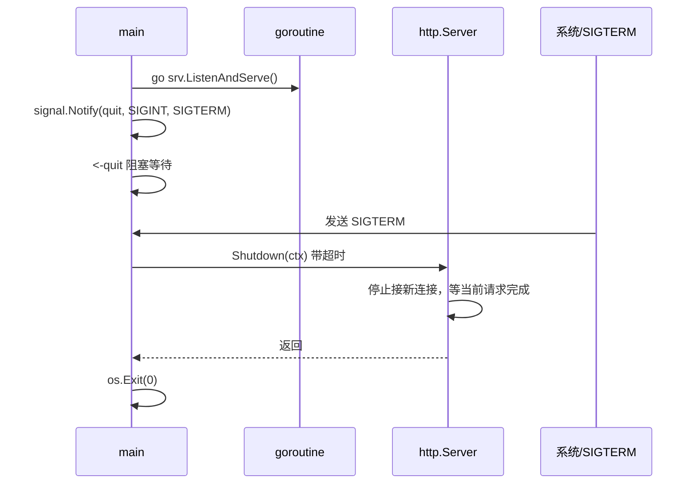

# [7天实战入门Go语言后端] Go 后端实战踩坑与解法手册

**博文链接**：[Go 后端实战踩坑与解法手册](https://blog.csdn.net/weixin_40959890/article/details/158179442)

本文档是一份**以「坑 → 解法」为主线的参考手册**，面向从入门到**中高级**的 Go 后端开发者：开发时预防踩坑、排错时快速定位、自我复习时能讲清「遇到过什么问题、怎么解决的」。可与 [INTERVIEW_TOPICS.md](INTERVIEW_TOPICS.md)（[博文：技术点讲解与自测要点](https://blog.csdn.net/weixin_40959890/article/details/158179409)）配合使用：前者偏「概念与自测答法」，本文档偏「问题与解法」。

---

## 综述：本文档是什么、怎么用

### 定义与定位

| 项 | 说明 |
| :--- | :--- |
| **是什么** | 按主题汇总 Go 后端开发中的**常见错误、异常现象、错误用法**，并给出**原因分析**与**可落地的解法**（含代码或配置示例）。每条尽量做到：现象可辨认、原因可理解、解法可复制、延伸可拓展。 |
| **写给谁** | 入门：学完本项目 day0～day7 / part2 后，按主题扫一遍，少犯表中列出的错。中高级：线上排错、代码评审、技术方案设计时，当作**查询手册**按类别或关键词查找，并参考「延伸」部分应对生产场景。 |
| **和 INTERVIEW_TOPICS 的关系** | INTERVIEW_TOPICS 讲「技术点 + 自测时可能怎么问、怎么答」；本文档讲「具体坑 + 怎么避免/怎么修」。复习时可以说「在项目里遇到过 XX 坑，用 YY 解决」，并指向本文档对应条目或本项目代码位置。 |

### 条目结构说明

每条「坑」的说明尽量包含：

- **现象**：你看到的表现（报错信息、错误响应、panic、错误数据等）。
- **原因**：为什么会出现（语言/库的语义、执行顺序、生命周期等）。
- **解法**：正确写法或操作步骤，必要时带简短代码/配置示例。
- **本项目位置**：本仓库中已按该解法实现的文件或示例，便于对照。
- **延伸**：中高级/生产场景下相关变体、进阶注意点、可进一步查阅的资料。

### 使用方式

| 场景 | 建议用法 |
| :--- | :--- |
| **开发前** | 写某一块（如 HTTP 响应、DB 事务、并发）前，扫一眼对应章节的标题和总表，避免典型坑。 |
| **排错时** | 根据现象（如「返回的 JSON 变成纯文本」「goroutine 越来越多」「连接超时」）在总表或章节内搜索关键词，对照「现象→原因→解法」。 |
| **代码评审** | 用总表做 checklist，看是否有响应头顺序、err 未检查、map 并发写、事务未 Rollback 等。 |
| **复习准备** | 挑 2～3 条自己确实遇到或容易讲的（如错误包装 %w、优雅关闭、事务 defer Rollback），能说清现象和解法，并指向本项目。 |

---

## 总表：按类别与频率速查

下表按**类别**和**常见程度**列出坑与解法所在章节，便于快速定位。标注「高」= 入门到中级阶段极易遇到；「中」= 中高级或特定场景常见。

| 类别 | 坑 / 问题 | 常见度 | 详见章节 |
| :--- | :--- | :--- | :--- |
| **HTTP** | 先写 Body 再设 Content-Type，导致 JSON 被当纯文本 | 高 | 一、HTTP 与响应 |
| **HTTP** | 路由末尾斜杠（前缀 vs 精确）搞混，导致 404 或错误匹配 | 高 | 一、HTTP 与响应 |
| **HTTP** | handler 返回后仍写 ResponseWriter（如 goroutine 里异步写） | 中 | 一、HTTP 与响应 |
| **HTTP** | 未设置 ReadTimeout/WriteTimeout，慢请求拖死连接 | 中 | 一、HTTP 与响应 |
| **语言** | 闭包捕获循环变量（goroutine 里打出 3,3,3） | 高 | 二、语言与并发 |
| **语言** | 多 goroutine 写同一 map 未加锁导致 panic | 高 | 二、语言与并发 |
| **语言** | channel 未 close 导致 for range 死等、或 close 后仍写 | 高 | 二、语言与并发 |
| **语言** | context 未 cancel 导致 goroutine/连接泄漏 | 高 | 二、语言与并发 |
| **语言** | Itoa/select/打印顺序等易混淆点误当 bug | 中 | 二、语言与并发 |
| **错误** | 包装错误用 %v 导致 errors.Is/As 失效 | 高 | 三、错误处理 |
| **错误** | 返回「无结果」用值类型导致零值歧义 | 高 | 三、错误处理 |
| **错误** | 未检查 err 就用返回值导致 nil 指针或错误逻辑 | 高 | 三、错误处理 |
| **数据库** | SQL 拼接导致注入；事务未 Commit/Rollback | 高 | 四、数据库与事务 |
| **数据库** | 连接未关闭或未用连接池；context 超时后连接未归还 | 中 | 四、数据库与事务 |
| **配置/部署** | godotenv 在 viper Load 之后执行，读不到 .env | 高 | 五、配置与部署 |
| **配置/部署** | 敏感信息进代码或 Git；未优雅关闭 | 高 | 五、配置与部署 |
| **配置/部署** | 健康检查未注册或返回非 200；镜像用 root | 中 | 五、配置与部署 |
| **依赖/环境** | go mod tidy 连不上 proxy（国内常见）；CGO 报错 | 高 | 六、依赖与环境 |
| **内存/性能** | 大切片/大结构体拷贝、循环里分配；未用 pprof 定位 | 中 | 七、内存、性能与安全 |
| **安全** | 敏感信息日志打印、依赖漏洞 | 中 | 七、内存、性能与安全 |

---

## 一、HTTP 与响应

### 1.1 先写 Body 再设 Content-Type（高）

- **现象**：想返回 JSON 格式的错误体，但客户端（或浏览器）仍按纯文本解析，或前端拿到的不是合法 JSON。
- **原因**：`http.ResponseWriter` 的语义是：**在第一次调用 `WriteHeader` 或 `Write` 之前**，必须把需要发送的响应头全部设好；一旦调用了 `WriteHeader`，后续再 `Set` 头不会生效。`http.Error()` 内部会调用 `WriteHeader`，若在此之前没有设置 `Content-Type`，响应头里就没有 `application/json`，客户端会按默认或 `Content-Type` 的旧值解析。
- **正确顺序**（务必按图做）：

- **解法**：凡是要返回 JSON（包括错误），**先** `w.Header().Set("Content-Type", "application/json")`，**再** `w.WriteHeader(...)` 或 `http.Error(...)`；顺序不能反。
- **本项目位置**：day2/server handleGetUser 错误分支；day7、part2 的 JSON 响应处均为先设头再写体。
- **延伸**：gin 里用 `c.JSON()` 会统一设置 Content-Type，一般不会踩；若手写 `c.Writer.Write()`，同样要先设头。生产里可用中间件统一为 API 设置 `Content-Type: application/json`。

### 1.2 路由末尾斜杠：前缀匹配 vs 精确匹配（高）

- **现象**：注册了 `/api/users`，访问 `/api/users/1` 返回 404；或注册了 `/api/users/`，以为只匹配 `/api/users/`，结果 `/api/users/1` 也进了同一个 handler。
- **原因**：标准库 `ServeMux` 规定：**以 `/` 结尾的 pattern 为前缀匹配**，不以 `/` 结尾为**精确匹配**。因此 `/api/users` 只匹配 path 恰好为 `/api/users`；`/api/users/` 匹配以 `/api/users/` 开头的 path（如 `/api/users/1`）。
- **解法**：列表/创建用精确 path：`/api/users`；按 id 查用前缀：`/api/users/`，在 handler 里用 `TrimPrefix` 取子路径再解析 id。两个路由都要注册，顺序无要求（长路径前缀会优先匹配）。
- **本项目位置**：day2/server main、day7 main（/api/users 与 /api/users/ 分开注册）。
- **延伸**：gin 等框架的路由规则可能不同（如支持 `:id`），需看文档；若用标准库或自研 mux，建议在文档里写明「尾斜杠 = 前缀匹配」。

### 1.3 handler 返回后仍写 ResponseWriter（中）

- **现象**：在 handler 里 `return` 之后，又在 goroutine 里或 defer 里对 `w` 做 `Write`/`WriteHeader`，导致重复写、panic 或不可预期行为。
- **原因**：`ResponseWriter` 在第一次写之后，头已发出，且连接可能已被复用或关闭；在 handler 返回后再写，违反 HTTP 语义，且可能与其他 goroutine 写同一连接。
- **解法**：所有写响应的逻辑必须在 handler 同步完成；若需异步处理，只做后台任务（如写 DB、发消息），不要异步写 `w`。需要「先响应再干活」时，先 `w.WriteHeader(200)` 并 flush（若支持），再起 goroutine 做后续逻辑，且不再碰 `w`。
- **本项目位置**：day5/day7 的 handler 均为同步写响应；无异步写 w 的示例。
- **延伸**：Streaming 场景（如 SSE）需在 handler 内持有一个长连接循环写，不能先 return 再在别的 goroutine 写。

### 1.4 未设置 ReadTimeout/WriteTimeout（中）

- **现象**：少数慢客户端或恶意慢读导致连接长时间占用，最终耗尽连接数或资源。
- **原因**：`http.Server` 默认不设 `ReadTimeout`/`WriteTimeout`，连接会一直等到对方关闭或超时（可能非常长）。
- **解法**：给 `http.Server` 设置合理的 `ReadTimeout`、`WriteTimeout`（如 10～30 秒），超时后服务端主动关闭连接。
- **本项目位置**：day7 未显式设置，可作为扩展在 main 里给 `Server` 赋值这两个字段。
- **延伸**：与 `context.WithTimeout` 配合：请求级超时控制业务逻辑，Server 超时保护连接资源；注意 `ReadTimeout` 从读到请求头开始算，大 body 会受限于此。

---

## 二、语言与并发

### 2.1 闭包捕获循环变量（高）

- **现象**：`for i := 0; i < 3; i++ { go func() { fmt.Println(i) }() }` 多次运行可能打出 3,3,3 而不是 0,1,2。
- **原因**：闭包捕获的是**变量 i 本身**（引用），而不是某次循环时的值。goroutine 真正执行时，循环可能已结束，i 已是 3。
- **解法**：把当前循环值作为参数传入：`go func(id int) { ... }(i)`，这样每个 goroutine 拿到的是当时的副本。
- **本项目位置**：day1/concurrency WaitGroup 示例；day1 csdn 易混淆点。
- **延伸**：循环里开 goroutine 时，若用 `i` 做 map key、slice 下标等，同样要传参或拷贝，否则 data race 或逻辑错误。

### 2.2 多 goroutine 写同一 map 未加锁（高）

- **现象**：运行时 panic：`concurrent map writes` 或 `concurrent map read and map write`。
- **原因**：Go 的 map 非并发安全，多 goroutine 同时读写会触发运行时检测并 panic。
- **解法**：写操作用 `sync.Mutex` 或 `sync.RWMutex` 保护；读多写少用 `RLock`/`RUnlock` 与 `Lock`/`Unlock` 区分。或把写操作串到同一个 goroutine（通过 channel 传递写请求）。
- **本项目位置**：day7/internal/store 用 RWMutex 保护 map；part2 同理。
- **延伸**：`sync.Map` 适用于读多写少且 key 稳定、可离散的场景；一般业务用 RWMutex + map 即可。注意读时若需要「读后根据结果再写」，要用 Lock 而不是 RLock，避免读锁内升级写锁。

### 2.3 channel 未 close 或 close 后仍写（高）

- **现象**：`for v := range ch` 永远不退出；或 panic：`send on closed channel`。
- **原因**：无缓冲或缓冲已空的 channel，若没有 close，range 会一直等；close 后若仍有 goroutine 往 channel 写，会 panic。
- **解法**：**谁创建 channel 谁负责 close**，且只 close 一次；close 后不再向该 channel 发送。通常由生产者 close，消费者用 `for v := range ch` 或 `v, ok := <-ch` 判断结束。
- **本项目位置**：day1/concurrency 有 close 示例。
- **延伸**：多个生产者时，可单独用一个「结束」channel 或 sync.Once 保证只 close 一次；或由协调者 goroutine 在收到所有完成信号后 close。

### 2.4 context 未 cancel 导致 goroutine/连接泄漏（高）

- **现象**：进程 goroutine 数或 DB/Redis 连接数随时间增长不降，最终 OOM 或连接耗尽。
- **原因**：`context.WithTimeout` / `WithCancel` 会返回一个 cancel 函数，若不调用 cancel，派生出的 context 不会 Done，依赖该 context 的 goroutine 或阻塞调用（如 DB 查询）可能一直不退出；连接也可能不会归还池子。
- **解法**：拿到 `ctx, cancel := context.WithTimeout(...)` 后，**在不用时立刻 `defer cancel()`**（或函数返回前调用）。这样超时或提前返回时，ctx 会 Done，下游可退出。
- **本项目位置**：day5 超时中间件、day1 context 示例；part2 若有带超时的 DB/Redis 调用，也应传 ctx 并 defer cancel。
- **延伸**：在 HTTP handler 里一般用请求的 context（如 `r.Context()`），不需要自己 cancel（请求结束即取消）；只有在**自己**派生出的子 context（如超时、取消）时才需要 defer cancel。

### 2.5 易混淆点：Itoa、select 与 Done、打印顺序（中）

- **Itoa**：`strconv.Itoa` 是 **Integer to string**（十进制字符串），不是「转 ASCII」。口述或注释写错会误导他人。
- **select 与 wg.Done**：变量名 `done := make(chan struct{})` 与 `wg.Done()` 方法易混，建议用 `ready`、`quit` 等区分。
- **goroutine 打印顺序**：多 goroutine 并发打印时顺序不固定是正常行为，不是 bug。
- **本项目位置**：day1/day2 注释与 csdn、rule/skill。

---

## 三、错误处理

### 3.1 包装错误用 %v 导致 errors.Is/As 失效（高）

- **现象**：用 `fmt.Errorf("xxx: %v", err)` 包装后，`errors.Is(err, ErrNotFound)` 或 `errors.As(err, &target)` 返回 false，无法识别底层错误。
- **原因**：只有用 `%w` 包装时，Go 会保留错误链，`Is`/`As` 才能递归展开；用 `%v` 或 `%s` 会变成普通字符串，链就断了。
- **解法**：需要调用方用 `Is`/`As` 时，一律 `fmt.Errorf("xxx: %w", err)`。
- **本项目位置**：day1/errors。
- **延伸**：自定义错误类型要实现 `Unwrap() error`，`As` 才能正确解包；标准库的 `fmt.Errorf("%w")` 会自动实现 Unwrap。

### 3.2 返回「无结果」用值类型导致零值歧义（高）

- **现象**：查库「查不到」时返回 `(User{}, nil)`，调用方无法区分「查到了零值用户」和「没查到」。
- **原因**：值类型没有「空」的表示，只能返回零值；零值在业务上可能合法（如 balance=0）。
- **解法**：返回指针 `*User`，查不到时返回 `(nil, nil)` 或 `(nil, ErrNotFound)`；调用方先判 err 再判 nil。或返回 `(User, bool)` 用 bool 表示是否存在。
- **本项目位置**：day1/basics FindUser 返回 *User。
- **延伸**：API 层返回 404 时，通常 body 里还会带 code/message，与「无结果」的语义一致。

### 3.3 未检查 err 就用返回值（高）

- **现象**：忽略 `err` 直接使用返回值，导致 nil 指针 panic、错误数据写入 DB、错误响应返回给用户等。
- **原因**：Go 的 error 必须显式处理，不写 `if err != nil` 就用了返回值，属于逻辑错误。
- **解法**：每次调用返回 err 的函数后，先 `if err != nil { ... return }`，再使用其它返回值。可配合 `errors.Is`/`As` 做分支处理。
- **本项目位置**：day1 多处、day4、part2 均遵循先判 err。
- **延伸**：少数场景（如 `json.Marshal` 已知类型一定可序列化）可以忽略 err，但要在注释里说明；静态检查工具如 errcheck 可帮助发现未检查的 err。

---

## 四、数据库与事务

### 4.1 SQL 注入与事务未 Commit/Rollback（高）

- **现象**：用户输入被拼进 SQL，导致注入（删表、越权）；或事务开启后未 Commit 也未 Rollback，连接一直占用或数据不一致。
- **原因**：拼接 SQL 字符串时未转义；事务在 panic 或提前 return 时未 Rollback，连接未归还池且可能持有锁。
- **解法**：**永远用占位符 + 参数**，如 `db.Exec("UPDATE t SET name=? WHERE id=?", name, id)`。事务用 `defer tx.Rollback()`（Commit 后 Rollback 是 no-op），确保任一路径都会释放连接。
- **本项目位置**：day4、part2 transaction-pprof-api 均用参数化；part2 Transfer 里 `defer tx.Rollback()`。
- **延伸**：ORM 或 sqlx 的 NamedExec 也是参数化；事务内避免长时间阻塞或调外部 HTTP，否则锁持有时间过长。

### 4.2 连接未关闭、未用连接池、context 超时后未归还（中）

- **现象**：连接数涨到上限、DB 侧 too many connections；或请求超时后连接未归还池子。
- **原因**：未用 `sql.DB`（DB 自带池）而自己开连接未关；或 context 取消后未正确终止查询，连接被占用到默认超时。
- **解法**：用 `sql.Open` 得到 `*sql.DB`，用 `DB.Exec`/`Query` 等，不要长期持有 `Tx` 或单独拿连接不还。所有会阻塞的 DB 调用都传 `ctx`，超时或取消时驱动会中断查询并归还连接。
- **本项目位置**：day4 用 DB；part2 事务里用 `BeginTx(ctx, nil)` 且 defer Rollback。
- **延伸**：`SetMaxOpenConns`/`SetMaxIdleConns`/`SetConnMaxLifetime` 根据压测调；只读从库可单独开一个 DB 池。

---

## 五、配置与部署

### 5.1 godotenv 在 viper Load 之后执行（高）

- **现象**：本地用 .env 配置，但 viper 读到的仍是空或旧值，服务行为不符合预期。
- **原因**：godotenv 会把 .env 里的键值**加载到进程的环境变量**；viper 的 `AutomaticEnv()` 是**读当前环境变量**。若先调 viper.Load 再调 godotenv.Load，则 Load 时环境变量里还没有 .env 的内容。
- **解法**：在 main 里**先** `godotenv.Load()`（或 Load(".env")），**再** `config.Load()`（内部用 viper 读 env）。
- **本项目位置**：day3 main：先 godotenv 再 Load。
- **延伸**：生产一般不用 .env 文件，而是由 K8s/云厂商把环境变量注入；本地和 CI 用 .env 即可，.env 不要提交 Git，用 .env.example 做模板。

### 5.2 敏感信息进代码或 Git、未优雅关闭（高）

- **现象**：密钥、密码写在代码里或误提交到 Git；或直接 kill 进程导致正在处理的请求被中断。
- **原因**：图省事把配置写死；未做优雅关闭，SIGTERM 后直接退出。
- **优雅关闭推荐流程**（按图实现即可）：

- **解法**：敏感信息一律从环境变量或配置中心读；.env 加入 .gitignore，用 .env.example 列 key 不列 value。服务监听 SIGINT/SIGTERM，收到后调 `http.Server.Shutdown(ctx)`，等当前请求处理完再退出。
- **本项目位置**：Day 3 README/csdn 提醒 .env 勿提交；Day 7 完整优雅关闭（goroutine + signal + Shutdown）。
- **延伸**：K8s 里会发 SIGTERM 并给 grace period；若需更长收尾时间，可适当调大 Shutdown 的 context 超时。

### 5.3 健康检查未注册或返回非 200（中）

- **现象**：负载均衡或 K8s 探针失败，实例被摘掉或重启。
- **原因**：没有注册 /health（或约定路径），或该路径返回 5xx/4xx，探针判定不健康。
- **解法**：为服务注册健康检查路径（如 `/health`），返回 200 和简单 body（如 `{"status":"ok"}`）；若有依赖（DB、Redis），可做简单探测再决定返回 200 或 503。
- **本项目位置**：day7 /health；part2 两个项目均有 /health。
- **延伸**：就绪探针（readiness）与存活探针（liveness）区分：就绪失败只摘流量，存活失败会重启 Pod；健康接口可根据需要区分两者。

---

## 六、依赖与环境

### 6.1 go mod tidy 连不上 proxy.golang.org（高，国内常见）

- **现象**：`go mod tidy` 或 `go get` 报错 `dial tcp ... connectex: ... failed to respond`，或长时间无响应。
- **原因**：国内或受限网络访问官方 proxy 超时或不稳定。
- **解法**：设置国内镜像并持久生效：`go env -w GOPROXY=https://goproxy.cn,direct`（或 goproxy.io、阿里云镜像等）。再执行 `go mod tidy`。不要保留 `proxy.golang.org` 在 GOPROXY 列表前面，否则仍会先尝试官方源。
- **本项目位置**：根 README「环境要求」、本节。
- **延伸**：私有模块需配置 GOPRIVATE；vendor 可把依赖拷到仓库，适合内网或对依赖版本要求极严的场景。

### 6.2 CGO 相关报错（中）

- **现象**：使用依赖 CGO 的包（如部分 SQLite 驱动）时，编译报错找不到 gcc 或 CGO 未开启。
- **原因**：该包需要 C 编译，而本机未装 gcc 或 `CGO_ENABLED=0`。
- **解法**：本仓库 Day 4 与 part2 的 SQLite 使用 **modernc.org/sqlite**（纯 Go），无需 CGO。若自己改用 go-sqlite3 等需 CGO 的驱动，需安装 gcc 并设 `CGO_ENABLED=1`；交叉编译时 CGO 较麻烦，可优先选纯 Go 驱动。
- **本项目位置**：day4/sqlite、part2 transaction-pprof-api 均用 modernc。
- **延伸**：Docker 多阶段构建时，若最终镜像不需要 CGO，可在 builder 阶段编译好静态二进制再拷贝，避免最终镜像带 gcc。

### 6.3 拉取依赖时 protocol error、checksum 等（中）

- **现象**：`go mod download` 或 tidy 时报 `protocol error: received DATA after END_STREAM`、checksum mismatch 等。
- **原因**：多为代理/网络瞬时问题，或缓存损坏。
- **解法**：重试 `go mod tidy`；清理模块缓存 `go clean -modcache` 再试（注意会重新下载所有依赖）；换一个 GOPROXY 镜像。
- **本项目位置**：国内环境实践，见本节。

---

## 七、内存、性能与安全

### 7.1 大切片/大结构体拷贝、循环内重复分配（中）

- **现象**：内存占用高、GC 压力大、延迟抖动。
- **原因**：在热路径上对大片内存做值拷贝；在循环里频繁 `make` 或 `append` 导致分配过多。
- **解法**：传指针或切片（注意只读时别被篡改）；预分配 slice 容量、复用 buffer；用 pprof heap 看分配热点，再针对性优化。
- **本项目位置**：day7 store List 返回副本避免外部改 map；part2 可配合 pprof 做接口级分析。
- **延伸**：benchmark + `go test -memprofile`、`-cpuprofile`，配合 pprof 火焰图定位；中高级会问「如何排查性能问题」，可答 pprof + 压测。

### 7.2 敏感信息打入日志、依赖漏洞（中）

- **现象**：日志或错误信息里带密码、token、手机号等；或依赖爆出 CVE。
- **原因**：打日志时直接把 request body 或 err 打全；未定期升级依赖。
- **解法**：日志里脱敏（如只打后几位、或打「***」）；错误信息对外返回通用文案，详细 err 只打日志。定期 `go list -m -u all`、`go get -u ./...` 或 Dependabot 升级依赖并跑测试。
- **本项目位置**：day7、part2 未打敏感字段；PITFALLS 与 day3 提醒 .env 勿提交。
- **延伸**：安全扫描可集成到 CI；生产日志级别建议 Info 及以上，避免 Debug 泄露过多信息。

---

## 八、扩展与生产常见（中高级参考）

以下条目不展开代码，仅作**索引**，便于中高级选手按关键词延伸查阅或自研解法。

| 方向 | 常见坑/注意点 | 简要解法方向 |
| :--- | :--- | :--- |
| **并发** | data race、锁顺序不一致导致死锁 | 用 `-race` 检测；约定锁顺序或使用同一把锁 |
| **HTTP** | 大 body 读入内存 OOM、表单/文件上传 | 流式读取、限制 body 大小、 multipart 分块 |
| **数据库** | 慢查询、N+1、长事务占锁 | 索引、批量查询、缩短事务边界、只读从库 |
| **缓存** | 缓存穿透/击穿/雪崩、分布式锁实现 | 空值缓存、布隆过滤器、单飞/互斥、过期时间打散 |
| **部署** | 镜像体积大、非 root、多阶段未利用缓存 | 多阶段 + 只拷二进制；USER 非 root；builder 层缓存 go mod |
| **可观测** | 日志无 trace_id、无法串起一次请求 | 中间件生成 request_id 注入 context 与日志 |
| **配置** | 配置热更新、多环境冲突 | viper Watch、按 env 区分文件或 key 前缀 |
| **RPC/HTTP** | 超时传递、重试与幂等 | context 传递超时；重试带退避；写操作做幂等键 |

---

## 九、使用与维护建议

1. **开发前**：按模块（HTTP、并发、DB、配置等）扫对应章节，减少重复踩坑。
2. **排错时**：根据报错或现象在总表或章节内搜关键词，对照「现象→原因→解法」。
3. **代码评审**：用总表做 checklist，重点看响应头顺序、err、map 并发、事务 Rollback、敏感信息、优雅关闭。
4. **复习自测**：选 2～3 条能讲清的（如 %w、优雅关闭、事务 defer Rollback），说清现象和解法，并指向本项目或本文档。
5. **协作**：团队内新增坑与解法时，按本文档的「现象/原因/解法/位置/延伸」格式追加，并注明对应 day 或 part2 文件，便于长期当参考书查询。

与本项目各 day 的 README/csdn 中「易踩坑」「注意点」互为补充：本文档做**集中汇总与深化**，各 day 做**当日相关提醒与链接**。
